The ESG Navigator is an Enterprise Social Governance questionnaire tool.

Question
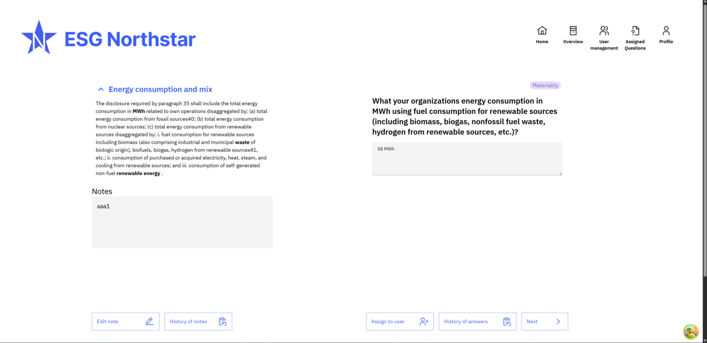

Question type: free text
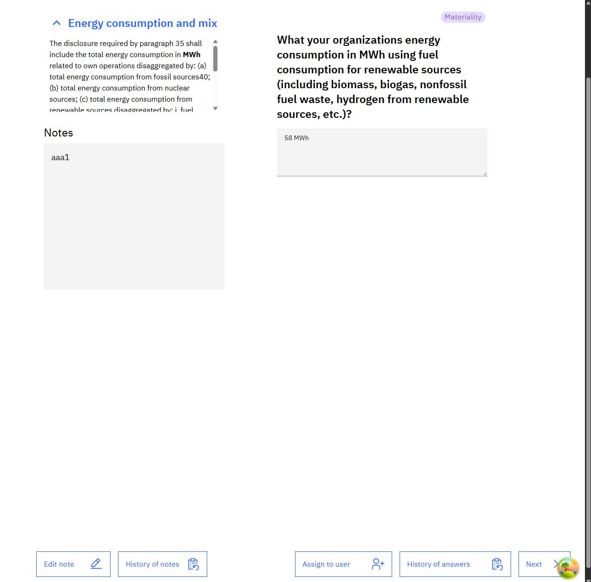

Question type: checklist (tablet)

Question type: date
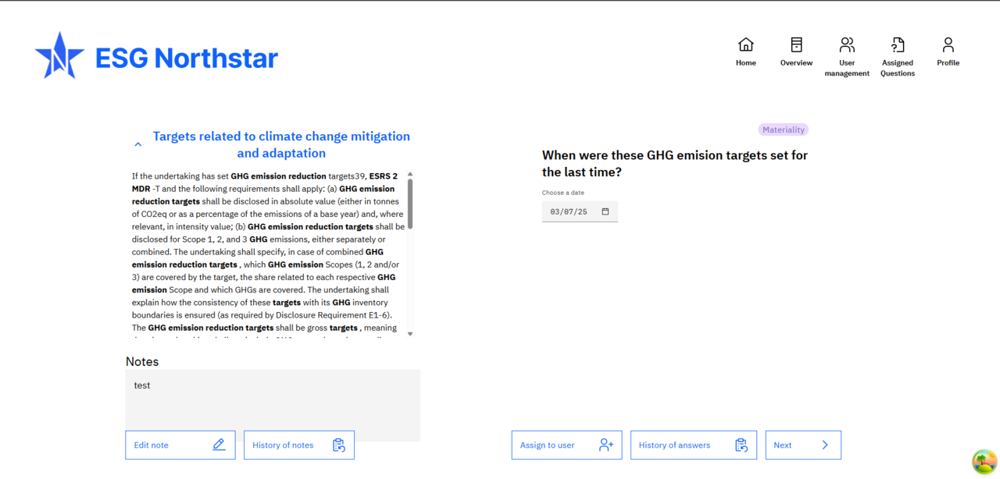

Question type: free text (mobile)
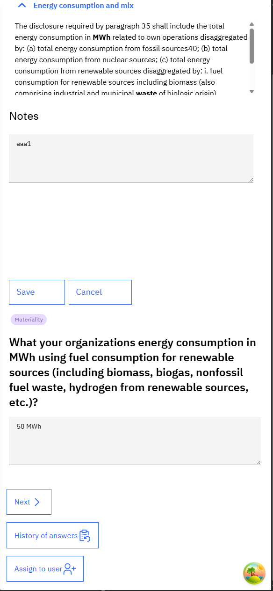

Question type: question list
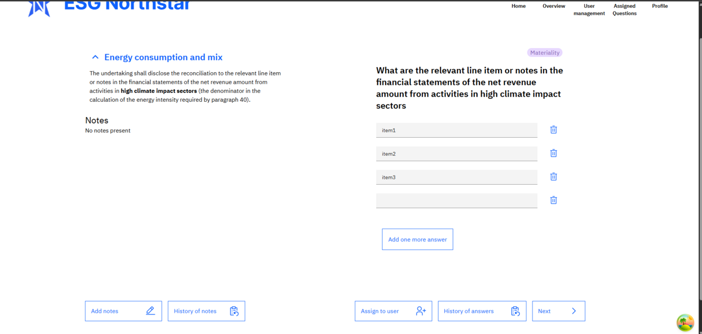

Question type: question list (tablet)
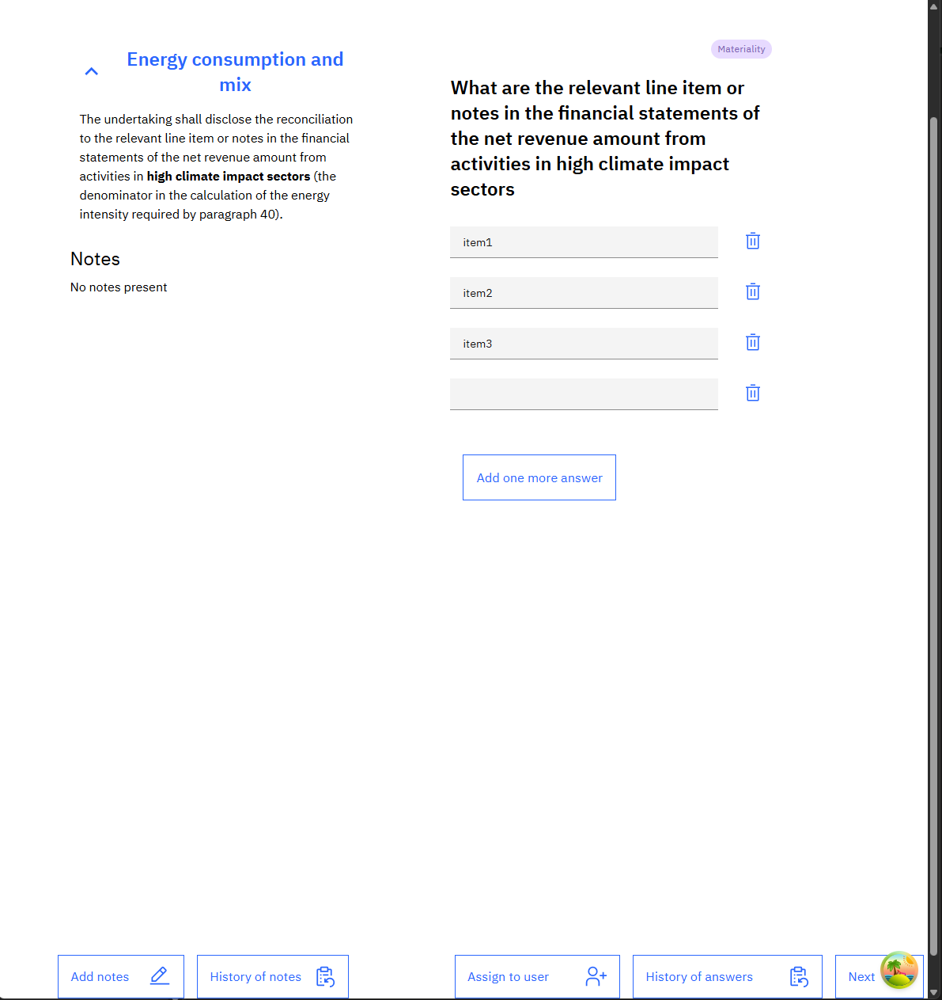

Question type: question list (mobile)
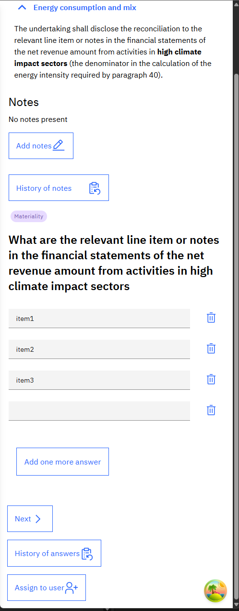

Question type: number
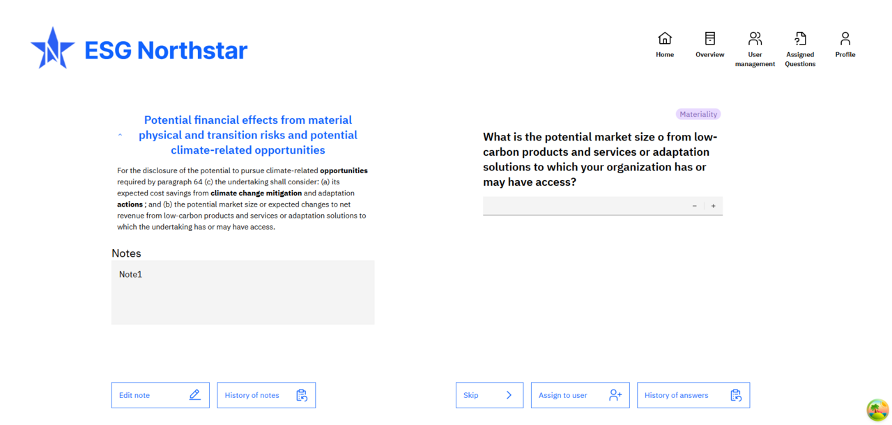

Question type: rating
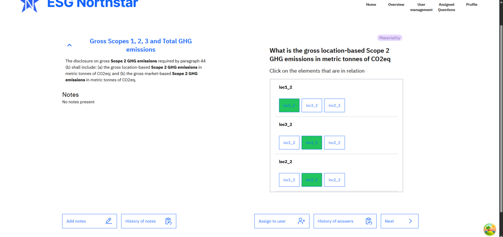

Question type: rating (mobile)
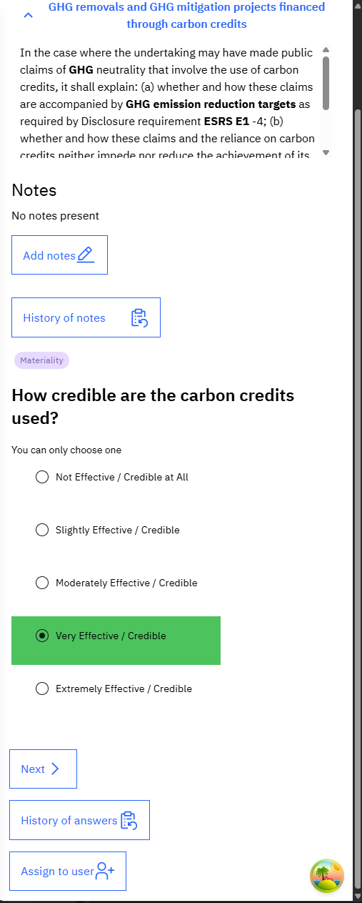

Question type: rating (tablet)
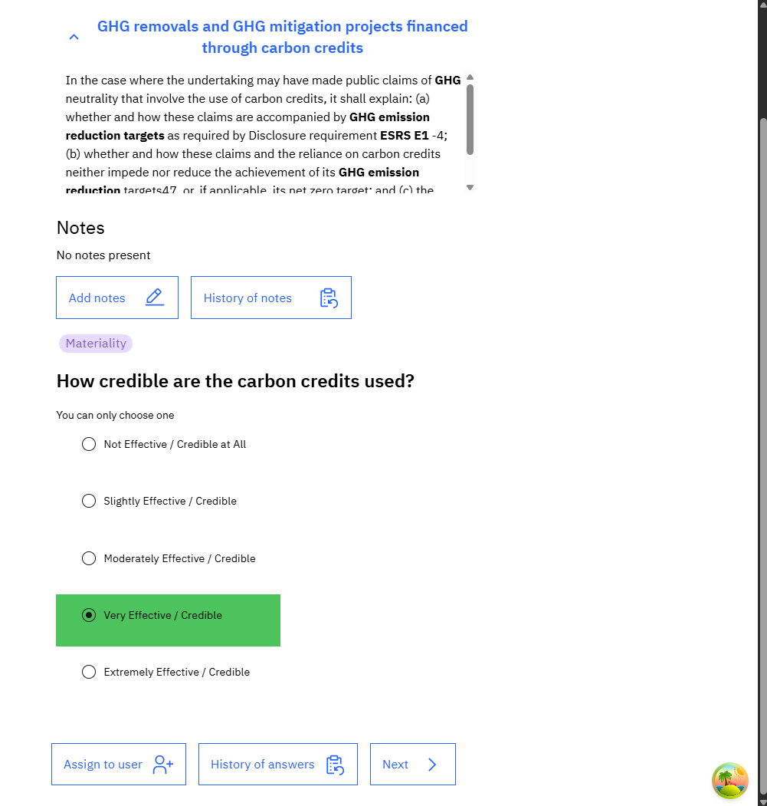

Question type: y/n
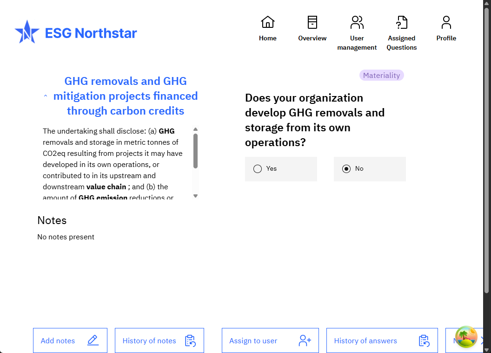

### Libraries
- ReactJS
- TypeScript
- TanStackQuery
- Next.js
- TailWind
- IBM Carbon Design
