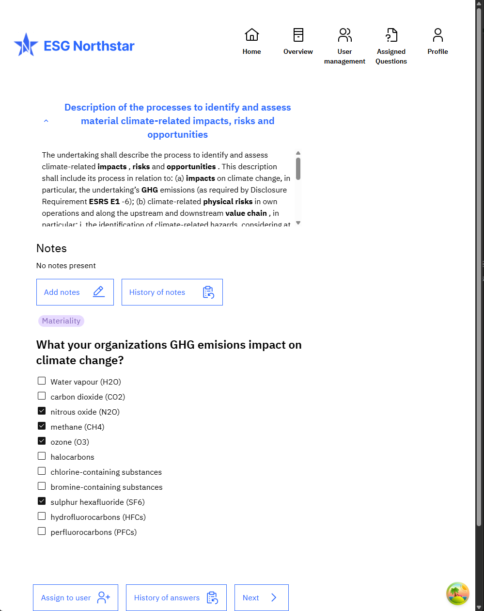
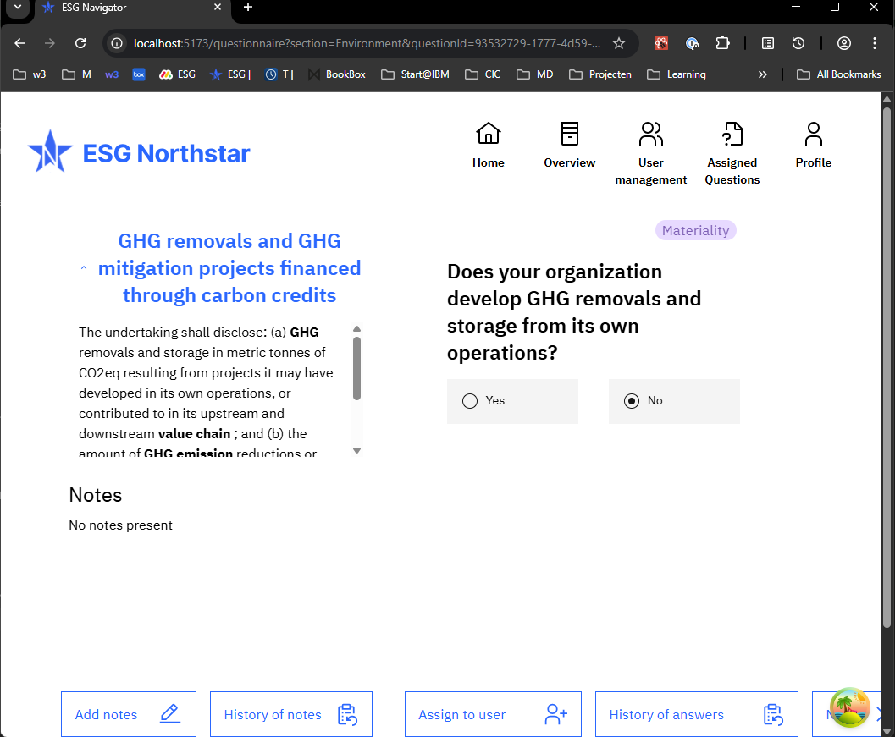

The ESG Navigator is an Enterprise Social Governance questionnaire tool.

Question

Question type: free text

Question type: checklist (tablet)

Question type: date

Question type: free text (mobile)

Question type: question list

Question type: question list (tablet)

Question type: question list (mobile)

Question type: number

Question type: rating

Question type: rating (mobile)

Question type: rating (tablet)

Question type: y/n

### Libraries
- ReactJS
- TypeScript
- TanStackQuery
- Next.js
- TailWind
- IBM Carbon Design
